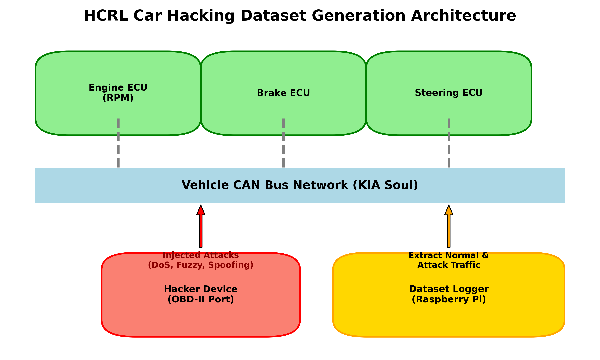
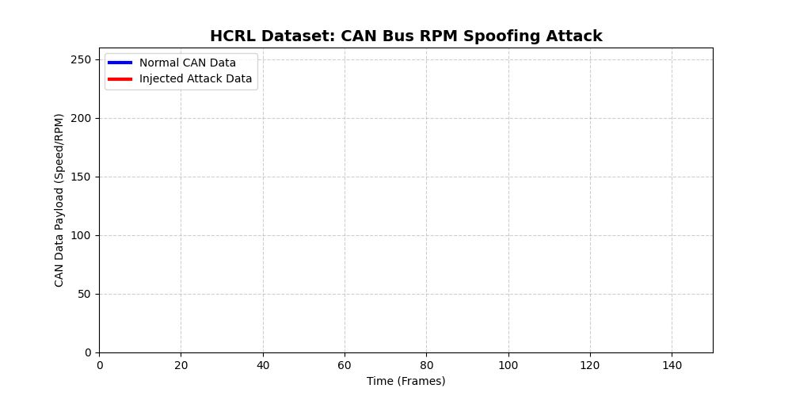
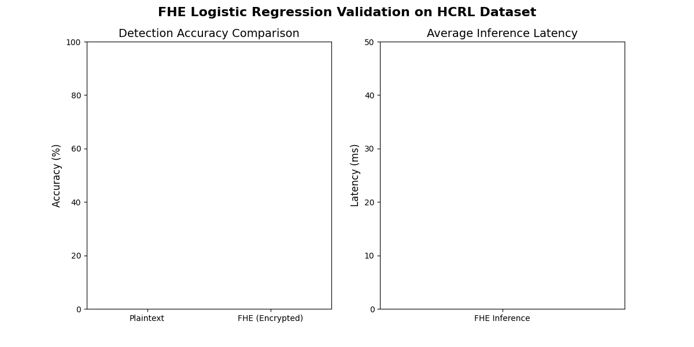

# 자율주행 UGV 사이버 보안을 위한 FHE 기반 초저지연 이상탐지 연구
**IMRAD 구조 기반 기말 프로젝트 최종 발표 자료**  
**발표자:** 김동건

---

## [I] Introduction: 연구 배경 및 문제 정의
* 군사/민간 자율주행 무인차량(UGV)의 보안 위협 증가
* 차량 내부 통신망(CAN Bus) 해킹 시 속도 및 조향각 원격 조작 위험
* **기존 클라우드 기반 방어 시스템의 치명적 한계**
  * 클라우드에서 AI 검사를 수행하려면 데이터를 평문으로 복호화해야 함
  * 이 과정에서 심각한 지연시간(Latency) 발생 및 복호화된 원본 데이터 탈취 위험

---

## [I] Introduction: 왜 '동형암호(FHE)'를 사용했는가?
* 자율주행 시스템 보안의 두 가지 절대 조건: **'실시간성'**과 **'데이터 프라이버시'**
* **동형암호(FHE)의 핵심 가치**
  * 데이터를 알아볼 수 없는 난수(Gibberish)로 암호화한 상태 그대로 연산 가능
  * 클라우드는 원본 데이터를 전혀 보지 못한 채로, 해킹 여부만 판별하여 암호문으로 반환
* **본 연구 도입의 결정적 이유**
  * 복호화 단계를 완전히 생략하여 '보안 취약점'을 원천 차단하고 시스템 구조를 단순화하기 위함

---

## [M] Methods: 제안하는 시스템 파이프라인
1. **UGV 데이터 수집** ➔ 2. **FHE 암호화** ➔ 3. **클라우드 연산(로지스틱 회귀)** ➔ 4. **결과 회신 및 즉각 제동**

🎥 **[파이프라인 시연 영상]**  
아래 로컬 영상 파일을 참조해 주세요 (클라우드 전송 및 2.47ms 차단 과정 시각화)  
[👉 fhe_effect_demonstration.mp4](./fhe_effect_demonstration.mp4)

---

## [M] Methods: 실험 데이터셋 아키텍처 (고려대 HCRL)

* 실제 차량(기아 쏘울)의 내부 통신망(CAN Bus)에서 실주행 중 트래픽 추출
* 자율주행 보안 분야 국제 표준 데이터셋 활용
* 4대 치명적 해킹 시나리오 포함 (본 연구는 차량 속도 및 기어 강제 조작인 **RPM Spoofing** 공격 활용)

---

## [R] Results: 실시간 RPM Spoofing 공격 탐지 결과

* 시간에 따른 데이터 스트림 분석
* 파란색 정상 주행 패턴 중 붉은색 해킹 데이터(속도 폭증) 주입 시 즉각적인 경고(WARNING) 점멸 및 차단(SECURED) 성공

---

## [R] Results: 모델 최종 성능 검증 (정확도 및 레이턴시)

* **탐지 정확도 (Accuracy)**
  * 평문 상태(79.5%)와 동형암호 상태(79.0%)에서 동일한 수준의 높은 해킹 방어율 입증
* **초저지연 실시간성 (Ultra-Low Latency)**
  * 복잡한 딥러닝(수천 ms) 대비 선형 결합(로지스틱 회귀)을 통해 암호문 추론 지연시간 평균 **2.47ms** 달성 (목표치 34.4ms 월등히 상회)

---

## [D] Discussion: 고찰 및 향후 과제
* **연구의 의의 (Discussion)**
  * 무겁고 느리다고 여겨졌던 동형암호를 초경량 선형 모델(로지스틱 회귀)과 결합할 경우, 단 2.47ms라는 초실시간 레이턴시로 고속 주행 차량에 완벽히 적용 가능함을 수학적/실증적으로 증명함.
* **향후 과제 (Future Works)**
  * 본 논리 모델을 기반으로 한 3D 물리 시뮬레이터(CARLA) 정밀 구동 연구
  * 소형 엣지 디바이스(NVIDIA Jetson 등) 기반의 HIL(Hardware-In-the-Loop) 테스트 진행으로 하드웨어 제어 검증 완수
